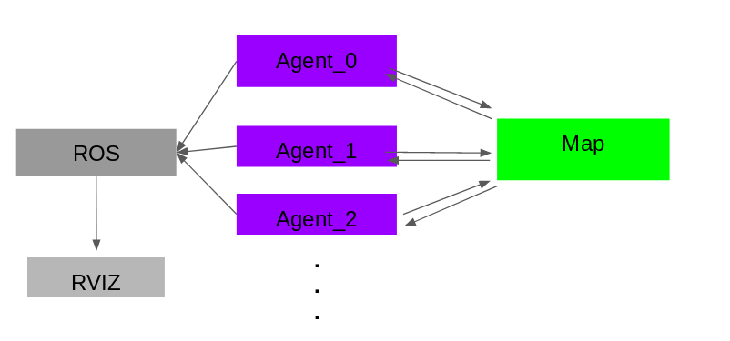

# CPPND: Capstone Parallel multi Agent Planning Repo
## INTRODUCTION
The goal of this project is to perfrom multi agent planning on a 2d grid map, while each agent should not step on the path while other agents has already taken except for the goal state. So we simulate n agents parallel planning both with heuristic plannig stratage towards the goal as fast as possible.
## METHOD
Below list major classes defined in the project:
1. simulate process: main function to run the algorithm and simulate visulization in ROS
2. Map: 2d grid map provie interface to read and write
3. Agent: the main planning process, a agent has shared pointer to the Map, in this case, all the agents share the same map when initized, when the agent tries to acess the map, the map will lock and unlock to make thread safe.

## RESULT AND IMPROVEMETNS
Here shows the reuslt of the planning process, 
the prameters of the agent start and goal can be modified in the `InititilzeObjects()`

## Dependencies for Running Locally
* cmake >= 3.7
  * All OSes: [click here for installation instructions](https://cmake.org/install/)
* make >= 4.1 (Linux, Mac), 3.81 (Windows)
  * Linux: make is installed by default on most Linux distros
  * Mac: [install Xcode command line tools to get make](https://developer.apple.com/xcode/features/)
  * Windows: [Click here for installation instructions](http://gnuwin32.sourceforge.net/packages/make.htm)
* gcc/g++ >= 5.4
  * Linux: gcc / g++ is installed by default on most Linux distros
  * Mac: same deal as make - [install Xcode command line tools](https://developer.apple.com/xcode/features/)
  * Windows: recommend using [MinGW](http://www.mingw.org/)

## Basic Build Instructions
### The code must run in ROS kineitc version on Ubuntu 16.04
1. In your catkin_ws workspace: `cd  ~/catkin_ws/src`
2. Clone this repo.
3  open the folder: `cd parallel_multi_agent_planning`
4. Make a build directory : `mkdir build && cd build`
4. Compile: `cmake .. && make -j8`
5. Then switch to top catkin_workspace: `cd ~/catkin_ws`
6. check: `ls`
7. you should be able to see: `build devel src`
8. Then run catkin_make: `catkin_make`
9. source the enviroment: ` source devel/setup.bash`
10. ros launch file to see the planning path in rviz: `roslaunch parallel_multi_agent_planning planning.launch`
